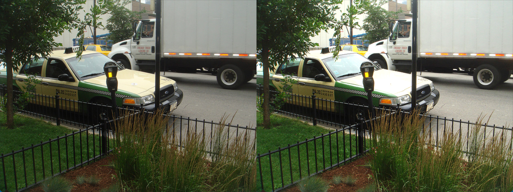
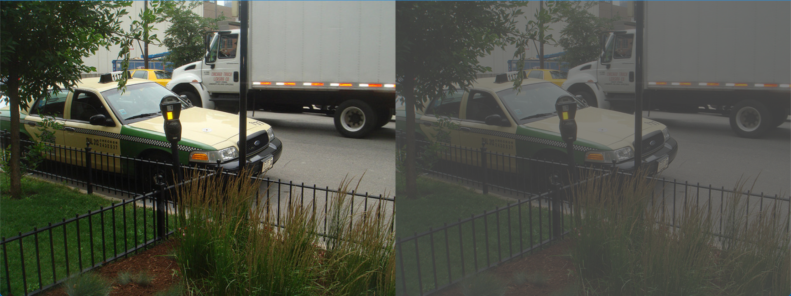
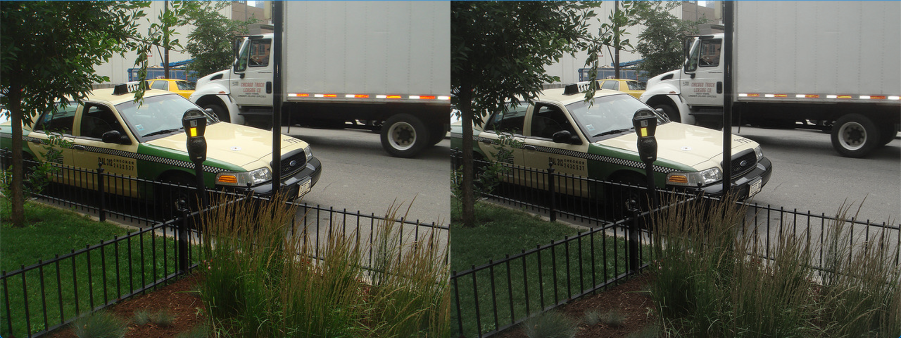
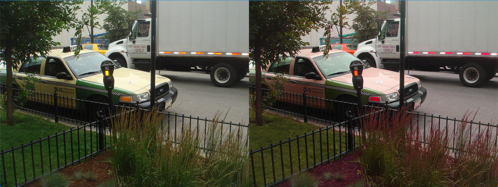
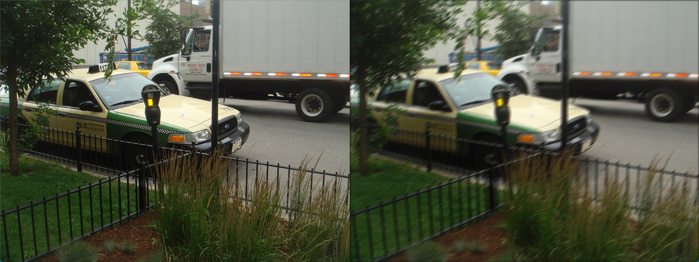
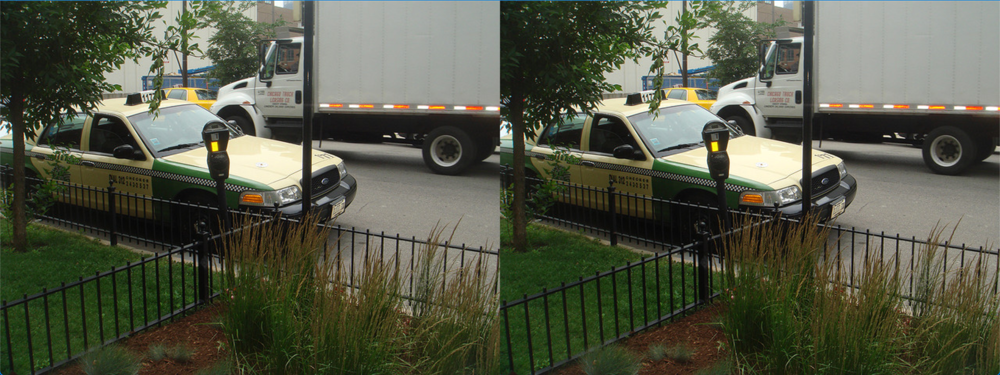
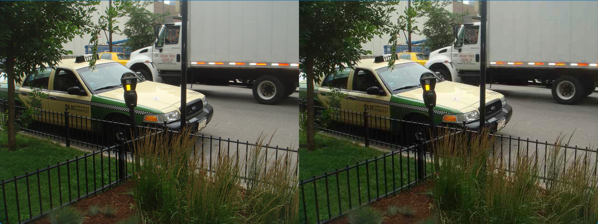
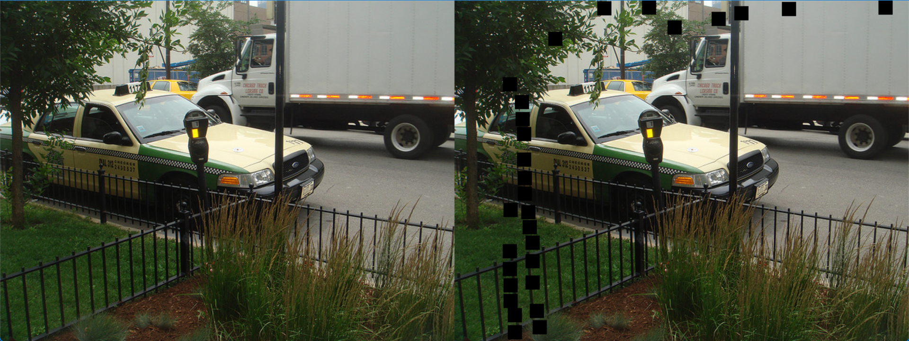
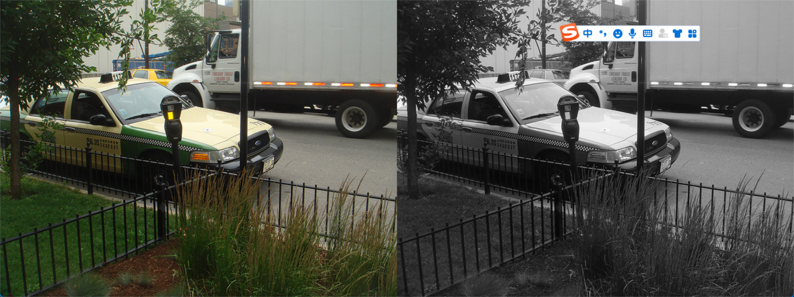
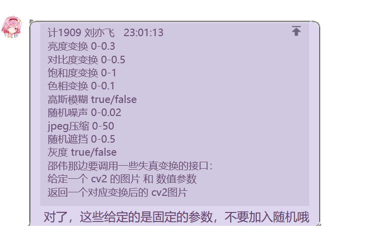

# 前端需要的失真变换的接口函数：
- 亮度变换`brightness_trans(img:cv2_img, brightness:float)`：
  - 参数：` brightness` [建议参数范围：`0~0.3`]
    - 这里的参数是增强参数 如果想要降低亮度 可以传入一个负值
  - 将传入的cv2 图片的亮度增加 
  - 效果：

```python
# 使用方法
from tools.interface.attack import *

img_res = brightness_trans(image, brightness)
```
-----
- 对比度变换`contrast_trans(img:cv2_img, contrast:float)`：
  - 参数：`contrast` [建议参数范围：`0~0.3`]
    - 如果想要获得增强对比度效果可以 传入一个大于1 的值
  - 算法：线性变换 ax+b `F.adjust_contrast() [也就是 transforms.ColorJitter() 中调整对比度使用的函数]`使用的函数似乎和这个变换的相似度特别高
  - 效果：contrast=0.3的时候与原图的对比（左侧原图）

```python
# 使用方法
from tools.attack.distortion_interface import *

img_res = contrast_trans(image, contrast_factor)
```
-----
- 饱和度变换`saturation_trans(img:cv2_img, saturation_factor:float)`：
  - 参数：`saturation_factor` [建议参数范围：`0~1`]
    - 当参数取值<=1时候 是减少图片饱和度的
  - 效果：当saturation_factor==0.5 

```python
# 使用方法
from tools.attack.distortion_interface import *

img_res = saturation_trans(image, saturation_factor)
```
-----
- 色相变换`hue_trans(img:cv2_img, hue_factor:float)`：
  - 参数：`hue_factor`[建议参数范围：0~0.1]
    - 参数的可取值范围在-0.5~0.5
  - 效果：hue_factor==0.1 

```python
# 使用方法
from tools.attack.distortion_interface import *

img_res = hue_trans(image, saturation_factor)
```
------
- 方向模糊 `motion_blur(img:cv2_img, kernel_size:int)`
  - 参数 `kernel_size:int` 决定模糊核大小  范围待定[当前变换使用的 0~3 (int)]
    - 说明： `kernel_size` 可以是任意整数 函数内部将使用 `2k+1` 将其转换成对应的奇数
    - 关于模糊方向： 模糊方向在函数内部是由 `random.uniform(0,180)` 来随机生成的。
  - 效果：变换核给的参数是 3

```python
# 使用方法
from tools.interface.attack import *

img_res = motion_blur(image, kernel_size)
```
-----

- 随机噪声`rand_noise(img:cv2_img, std:float, mean=0:float)`
  - 参数 `std`高斯分布的标准差 可以接受`list`；`mean`高斯分布的均值 默认0 可接受`list`
  - 给图片添加一个随机噪声 内置的标准差其实是std
  - std=0.02时
  * 这里我建议用0~0.2 这样比较明显。

```python
# 使用
from tools.attack.distortion_interface import *

img_res = rand_noise(image, 0.01)
img_res = rand_noise(image, [0.01, 0.02, 0.01])
```
-----
- jpeg压缩`jpeg_trans(img:cv2_img, factor:float)`
  - 参数`factor ` [建议范围1~50]
  - 效果：factor=30（右图）

```python
# 使用方法
from tools.attack.distortion_interface import *

img_res = jpeg_trans(image, factor)
```
-----
- 随机遮挡`rand_erase(img:cv2_img, _cover_rate:float, block_size=20:int)`
  - 参数`_cover_rate` 覆盖率；`block_size=20`单位遮挡快大小 （方形 默认20）
  - 效果(每次的遮挡面积不固定但是<覆盖率*图片面积)：

```python
# 使用方法
from tools.attack.distortion_interface import *

# 
img_res = rand_erase(image, _cover_rate, block_size=20)
```
-----
- 灰度变换`grayscale_trans(img:cv2_img, flag:bool)`
  - 参数 `flag`
  - 效果：

```python
# 使用方法
from tools.attack.distortion_interface import *

img_res = grayscale_trans(image, flag)
```


- 