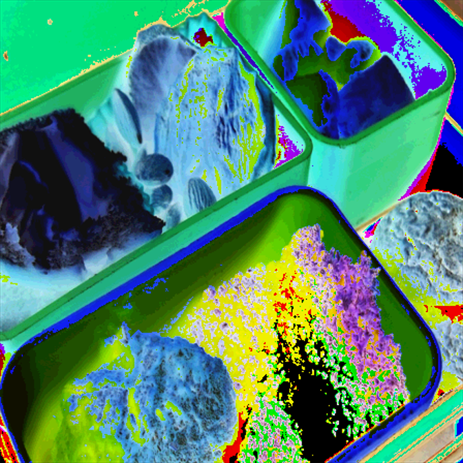

# 自定义AutoAugmentation [^1] 文档
## augmentation组件组成：
```
├─MyAugmentation
│      myDistortionOps.py
│      transPolicy.py
│      __init__.py (可忽略)
```
## 基本思想：
- 在transPolicy中声明基本的变换方法，变换方法执行的概率，每一个变换对应的变换范围
- 在MyDistortionOps中定义各种的变换，并将这些变换的接口提供给transPolicy 供transPolicy调用。
- 在transPolicy中对一张图像的变换最多执行两次，每一次的执行都是存在一定的概率。
## 使用方法：
```
随机挑选一个图像变换策略对img:torch.Tensor形式的数据进行变换
        Example:
        >>> policy = myPolicy()
        >>> transformed = policy(image:torch.Tensor)

        可以作为pytorch transforms:
        >>> transform=transforms.Compose([
        >>>     transforms.Resize(img_size),
        >>>     transforms.toTensor(),
        >>>     myPolicy()
        >>>     ])
```
## transPolicy.py
- transPolicy 中定义了各种的对图像的变换方法 即-subPolicy
- subPolicy 的组成：
``` python
def SubPolicy(p1,             # 第一次变换执行的概率
              operation1,     # 第一次变换的操作
              magnitude_idx1, # 第一次变换的操作所需要的参数下标
              p2,             # 第二次变换执行的概率
              operation2,     # 第二次变换的操作
              magnitude_idx2, # 第二次变换的操作所需要的参数的下标
              fillcolor=(128, 128, 128)) # 填充颜色（暂时没用）
```
- myPolicy中拥有的子策略：
```python
            SubPolicy(0.9, "shearX", 4, 0.2, "invert", 3, fillcolor),
            SubPolicy(0.9, "shearY", 8, 0.7, "invert", 5, fillcolor),
            SubPolicy(0.6, "equalize", 5, 0.6, "solarize", 6, fillcolor),
            SubPolicy(0.9, "invert", 3, 0.6, "equalize", 3, fillcolor),
            # SubPolicy(0.6, "equalize", 1, 0.9, "rotate", 3, fillcolor),

            SubPolicy(0.9, "shearX", 4, 0.8, "autocontrast", 3, fillcolor),
            SubPolicy(0.9, "shearY", 8, 0.4, "invert", 5, fillcolor),
            SubPolicy(0.9, "shearY", 5, 0.2, "solarize", 6, fillcolor),
            SubPolicy(0.9, "invert", 6, 0.8, "autocontrast", 1, fillcolor),
            # SubPolicy(0.6, "equalize", 3, 0.9, "rotate", 3, fillcolor),

            SubPolicy(0.9, "shearX", 4, 0.3, "solarize", 3, fillcolor),
            SubPolicy(0.8, "shearY", 8, 0.7, "invert", 4, fillcolor),
            # SubPolicy(0.9, "equalize", 5, 0.6, "translateY", 6, fillcolor),
            SubPolicy(0.9, "invert", 4, 0.6, "equalize", 7, fillcolor),
            # SubPolicy(0.3, "contrast", 3, 0.8, "rotate", 4, fillcolor),

            # SubPolicy(0.8, "invert", 5, 0.0, "translateY", 2, fillcolor),
            SubPolicy(0.7, "shearY", 6, 0.4, "solarize", 8, fillcolor),
            # SubPolicy(0.6, "invert", 4, 0.8, "rotate", 4, fillcolor),
            # SubPolicy(0.3, "shearY", 7, 0.9, "translateX", 3, fillcolor),
            SubPolicy(0.1, "shearX", 6, 0.6, "invert", 5, fillcolor),

            # SubPolicy(0.7, "solarize", 2, 0.6, "translateY", 7, fillcolor),
            SubPolicy(0.8, "shearY", 4, 0.8, "invert", 8, fillcolor),
            # SubPolicy(0.7, "shearX", 9, 0.8, "translateY", 3, fillcolor),
            SubPolicy(0.8, "shearY", 5, 0.7, "autocontrast", 3, fillcolor),
            SubPolicy(0.7, "shearX", 2, 0.1, "invert", 5, fillcolor)
```
- 说明 操作所需要的参数 在policy中是被定义为一个list 的如`  np.linspace(0, 0.3, 10)` 当调用该操作的时候调用函数会传来一个idx从而得到参数。
## myDistortionOps.py
```python
# 操作一览：
            "shearX": ShearX(),
            "shearY": ShearY(),
            # "translateX": TranslateX(),
            # "translateY": TranslateY(),
            # "rotate": Rotate(),
            "color": Color(),
            "posterize": Posterize(),
            "solarize": Solarize(),
            "contrast": Contrast(),
            "sharpness": Sharpness(),
            "brightness": Brightness(),
            "autocontrast": AutoContrast(),
            "equalize": Equalize(),
            "invert": Invert(),
```
- shearX
  - 范围参数:magnitude 范围:[-30~30] 角度 dtype: float
  - 
- shearY
  - 范围参数:magnitude 范围:[-30~30] 角度 dtype: float
  - 
- AutoContrast
  - 无参数 
  - 感觉和原图没啥区别
- Contrast
  - 范围参数:magnitude 范围:[0.0~2.0] 对比度因子 dtype: float
  - 对比度2: 
  - 对比度0.5: 
- Invert
  - 无参数 颜色翻转
  - 
- Equalize
  - 无参数 对图像做直方均衡化
  - 
- Flip
  - 无参数 对图像进行翻转 水平翻转或者垂直翻转
  - 
  - 
- Solarize
  - 范围参数:magnitude 范围:[0~255]  dtype: float
    - 操作说明： 指定一个像素值，对原图中高于该值的像素进行翻转操作
  - 翻转灰度值>=250的灰度
- Posterize
  - 范围参数:magnitude 范围:[4~8]  dtype: int
    - 操作说明：减少组成图片的色彩的种类，为每一个channel保留n bits位颜色
  - 将原先8 byte色深变成4 byte色深
  - 
- Color
  - 范围参数:magnitude 范围:[0.0~3.0] 饱和度 dtype: float
  - 饱和度为2
  - 饱和度为1（原图）
  - 饱和度为0（灰度图）
- Brightness
  - 范围参数:magnitude 范围:[0.0~3.0] 亮度 dtype: float
  - 亮度为1.8:
  - 亮度为1:
  - 亮度为0:
- Sharpness
  - 范围参数:magnitude 范围:[0.0~3.0] 锐化因子 dtype: float
  - 锐化因子3:
## 自定义的数据增强方法的优点和不足：
  - 优点：
    - 使用了一种统一包装的方式，将变换的方法定义到一起，便于拓展
    - 使用了显示的条件概率控制变换产生的可能。
  - 缺点：
    - 缺少了动态的变换参数
    - 策略中只有两次变换 显然不合理
    - 存在一些冗余的变换方式 这些图像变换方式可能并不适合本项目（有优化空间）
## 我对这个方法的一点看法
  - 我觉得这个方法是存在可拓展的优点 可以在这个基础上将我们自己的数据增强的策略集成上去 将我们的增强策略变为一个类似模块，减少一些（视觉上的【狗头】）冗余。
[^1]: 来源AutoAugment论文：https://arxiv.org/abs/1805.09501v3