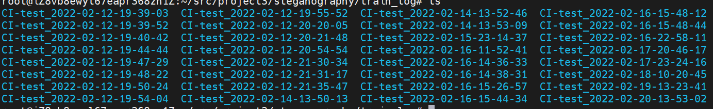
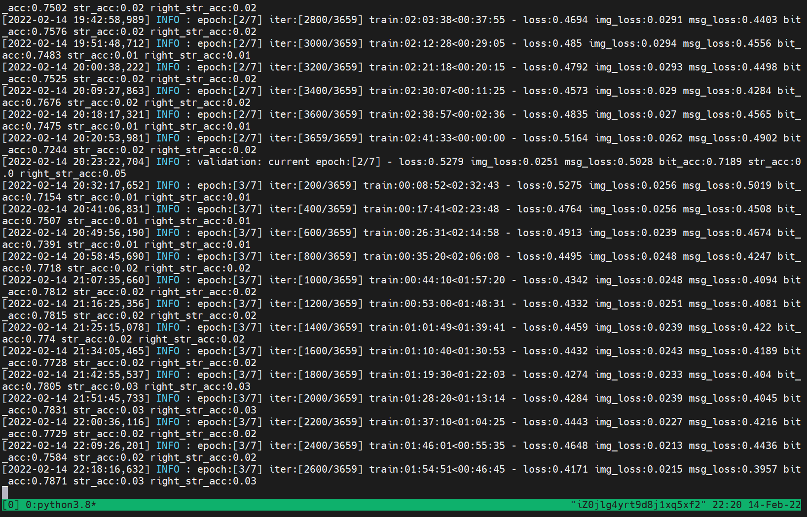
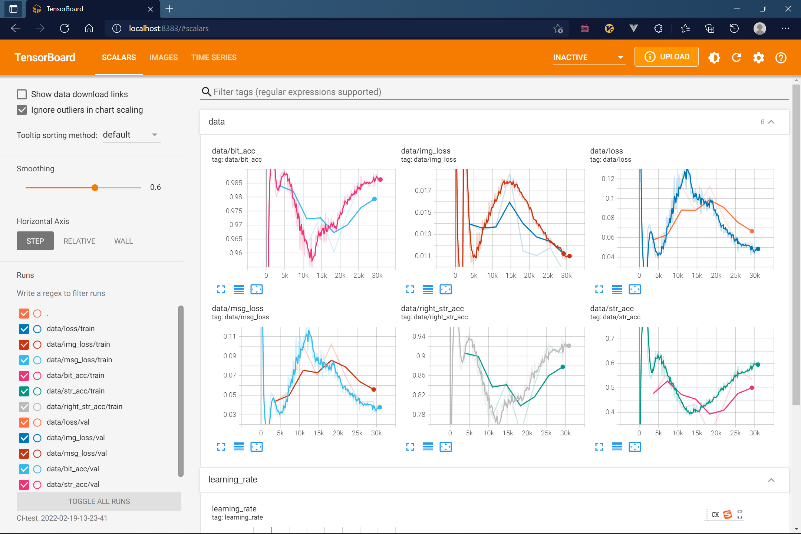
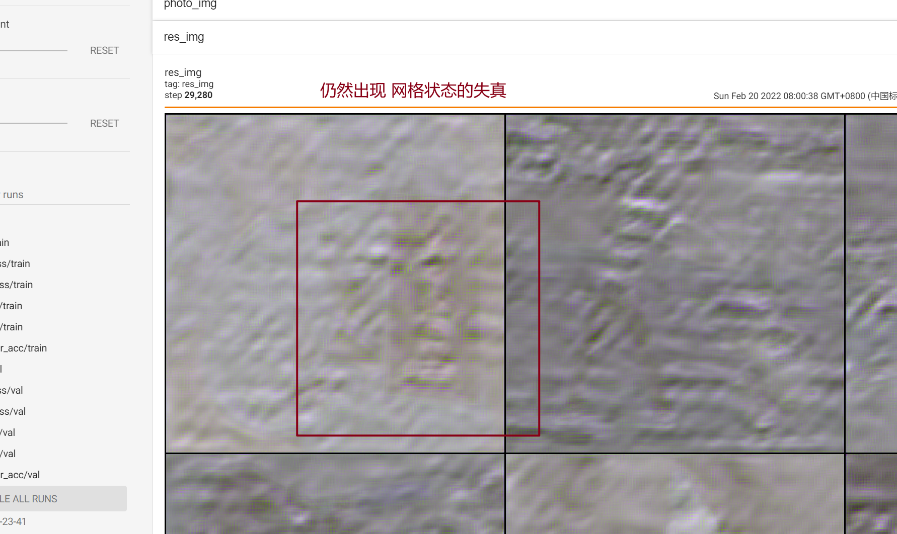

- make_trans2() :训练局部识别的模型  记得给一些模型加载中断的训练 
- [2.13] 使用自己的变换 make_trans4() 出问题了 应该是添加了太多的冗余的变换
- [2.14] 
  - 使用原变换 make_trans2() 使用了crop的变换
    - 一开始 可能是由于模型在适应所以有一个很明显的下降过程 但是随后 大部分的loss 都在下降 
    - 
      - 除了 img loss 呈现了不同寻常的 有一个升高的过程。 
    - 
    - 第三个epoch之后 有所好转
    - 
  - 使用 
- [2.15] 继续昨天晚上断开的make_trans2()的训练 增加epoch 看看后期的str_acc 能不能涨上去。
  - 实验表明 right_str_acc 在训练过程中一直在涨 可以查看 CI-test_2022-02-14-13-53-09 来观察训练的效果
  - 需要将img_loss 降到至少1%之下img_最后的效果才会显得和原图差不多。
  - 另外 采用make_trans2() 训练出来的图片会有部分出现网格装的变化。
  - 需要不断的跑 不断加强运算  这一部分的结果可以在CI-test_2022-02-14-13-53-09 这个train中继续 
- [2.15] 修改rand_cover 开始的地方 将其推迟。。。（如果rand_crop 训练的就特别困难 如果我再加上rand_cover 最终的结果可见不会太好。能否通过预训练加载？）
  - 将perspective_trans 的最大值设置为0.3
  - CI-test_2022-02-14-13-53-09 训练整体 使用的变换函数：make_tarns4()
  - 
  - loss在增加
- [2.16] 
  - 引入的perspective 和 rand_cover 对模型的影响太大了 5个epoch 不见模型有好转。
  - 前训练日志 CI-test_2022-02-15-23-14-37
- [2.16]
  - 测试perspective 对训练的影响：
  - 将rand_cover 的上限调小
  - 测试证明添加了rand_cover后acc下降的太快了。
- [2.16]
  - 开始 使用 局部和整体并行的方法开始训练 