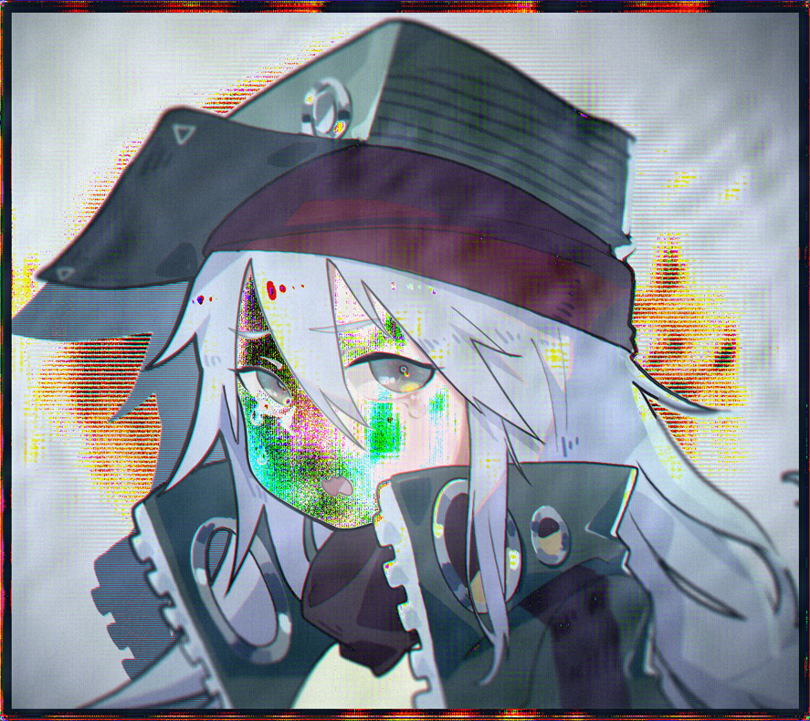

# 超分：
### 使用的超分辨率模型
### 使用SRZoo (一个涵盖了很多超分模型的集合)
- 进行初次的 resize (原图h, 原图w) -> (448 , 448)
- 使用超分将res_img upScale x 4 -> (448x4, 448x4)
- 然后(448x4, 448x4) -> (原图h, 原图w)
  - 使用的超分模型：EDSR-baseline  x4
  - 将超分后的图像叠加到原图中：
    - 效果：
    - 
    - 试着将 经过超分之后的res_img clamp到（0. ， 1.）之间
    - md 好像是resize的时候出问题了 woc 确实是res图反了！
