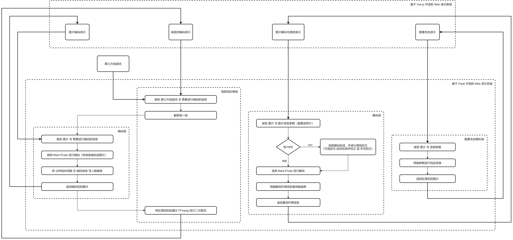

# Demo 开发文档摘要

V 2.5.20220410


> #### Update 5：
>
> v2.4.20220310  **To**  v2.5.20220410
>
> Date：2022.04.10
>
> - **前端**：
>   - **优化** 视频拉流时的缓存管理机制。
>   - **优化** 响应式布局逻辑，现在在任意浏览器高度下，主题部分始终在画面中央。
>
> 
>
> #### Update 4：
>
> v2.3.20220308  **To**  v2.4.20220310
>
> Date：2022.03.10
>
> - **后端**：
>   - **优化** 模型初始化与调用的方式，在后端启动之初即可完成模型的初始化。
>   - **优化** 视频流推流时的帧更新逻辑，现在会强行丢掉没来得及处理的历史帧。
>   - **增加** 强行杀死线程的工具类（但并没有在项目中使用）。
> - **其他**：
>   - 经测试：完成初始化后，显存占用 2.2GB；进行视频编码时的占用为 2.8GB；编码视频流帧率最高为 12，平均为 11，CPU 负载平均为 50% 。如果将类型转换剥离出编码接口，CPU 直接满载，且最高帧率降至 10，平均为 9。
>   - 测试用例：Dell Inspiron 7591(2019)（i7-9750H，GTX 1650 4G，16G）。
>
> 
>
> #### Update 3：
>
> v2.0.20220225  **To**  v2.3.20220308
>
> Date：2022.03.08
>
> - **前端**：
>   - **增加** 解码内容和置信度的显示。
> - **后端**：
>   - **增加** 编解码器的引入，现在可以真正地编解码图片与溯源了，并支持了视频流的编码（目前 FPS 大概为 11）。
>
> 
>
> #### Update 2：
>
> v1.1.20220209  **To**  v2.0.20220225
>
> Date：2022.02.25
>
> - **前端**：
>   - **重构** 前端界面，注重了演示时的 *对比*  效果。
>   - **增加** 编码图的下载功能。
>   - **增加** 解码溯源前的 自动标定 面板（需要算法协同：目前仅实现面板，后端的算法尚未跟进）以及 截图或照片 的选择功能。
>   - **增加** 图像攻击部分，实现实时效果预览，支持攻击后的图片送入 Decoder 解码溯源，支持攻击后图片的下载。
>   - **修改** 图片在前端的临时保存方式。
> - **后端**：
>   - **新增** 图像攻击接口。（目前存在问题：JPEG 压缩 存在对特定图像尺寸的限制）
>   - **修改** 编码信息接收接口，现在可以送入除 ID 以外的编码信息。
>   - **修改** 图像编码逻辑，现在可以在单张图像编码后写数据库。
>   - **修改** 视频流编码逻辑，现在可以通过前端送入除 ID 以外的编码信息。
>   - **修改** 图像解码逻辑，预留 自动标定 接口，区分 截图或照片。
>
> 
>
> #### Update 1：
>
> v1.0.20220125  **To**  v1.1.20220209
>
> Date：2022.02.09
>
> - **Encoder 部分**：**新增** 图片上传接口（可以对单张图片进行编码，并且回显编码后结果图以比较）。
> - **Decoder 部分**：**新增** 透视变换后结果图回显；**修改** 透视变换部分逻辑（现在所有的图片都将映射到 400 × 400 的尺寸中）。


## 架构



### 前端

前端分为以下 五 个模块：

1. 首页：即介绍页，标明本演示程序演示的项目、项目版本与项目开发方。

2. 编码隐写演示：

   - 图片编码演示：本页分为三个部分：`原图` 部分、`编码图` 部分、`控制台` 部分。用来演示并比较图片在编码前后的差异。

     - `原图` 部分：要求用户上传一张需要进行隐写编码的图片；用户点击上传后，可以点击刚刚上传的图片进行预览，可以点击图片下方的 `重新上传` 按钮来重新上传图片（该按钮也会清除网页缓存的已经编码过的结果图），也可以点击 `确认上传` 按钮将图片送入 `Mark-Probe` 进行编码，编码完成后图片会回传到 `编码图` 部分显示，并且网页顶部显示 `上传成功！` 消息。

     - `编码图` 部分：这里显示用户最终上传后的编码结果图。用户可以点击编码结果图下方的 `下载编码图` 按钮以下载编码完成的结果图。

     - `控制台` 部分：这里会显示当前系统日期与时间，以及两个输入框和一个按钮。

       - 输入框部分是用来填写编码进图片的自定义信息的，`ID` 为必选字段，`附加信息` 为可选字段，点击下方的 `提交 ID 与 附加信息` 按钮即可将想要编码进图片的信息提交到后端，接着页面顶端会显示后端接受到的自定义编码信息或错误提示信息。
       - 而后再在 `原图` 部分点击 `确认上传` 按钮将图片进行编码，上传成功后，在 `编码图` 部分则显示编码了自定义信息的编码结果图。

       > 其他说明：
       >
       > 这里推荐先在 `控制台` 部分提交自定义编码信息，然后再在 `原图` 部分上传图片，再编码图片。如果启动本演示程序后从未提交过自定义信息，并且已经进行了图片编码，则编码结果图所含信息为后端算法的预置信息；此时若要自定义编码信息，只需在 `控制台` 部分提交自定义编码信息，再进行图像编码即可。

   - 视频流编码演示：本页分为三个部分：`源视频流` 部分、`编码视频流` 部分、`控制台` 部分。用来演示并比较视频流在编码前后的差异。

     - `源视频流` 部分：这里显示实时 源视频流 传输的视频；用户可点击下方的 `开始拉流` 按钮来使中间部分的视频框播放源视频流传输的视频，此时按钮字样会变为 `停止拉流` ，点击后视频框将停止播放视频。视频框部分允许用户进行暂停、全屏、音量调节与开启画中画。

     - `编码视频流` 部分：这里显示实时 编码视频流 传输的视频；功能说明同 `源视频流` 部分，唯一差异在于视频框拉流后显示的是编码视频流传输的视频。

     - `控制台` 部分：这里会显示当前系统日期与时间，以及两个输入框和两个按钮。

       - 输入框部分是用来填写编码进编码视频流的自定义信息的，`ID` 为必填字段，`附加信息` 为可选字段，点击下方的 `提交 ID 与 附加信息` 按钮即可将想要编码进编码视频流的信息提交到后端，接着页面顶端会显示后端接受到的自定义编码信息或错误提示信息。
       - 而后再在 `编码视频流` 部分点击 `开始拉流` 按钮会获得编码了自定义信息的编码视频流（如果按钮字样为 `停止拉流` ，则需先点击该按钮，停止后端的编码进程，然后按钮字样会变成 `开始拉流` ，这样就可以正常使用了）。
       - `同时开始拉流` 按钮即用来同时拉取源视频流和编码视频流，同时 `源视频流` 部分和 `编码视频流` 部分会分别显示各自的拉取到的视频流，这样能够方便用户观察比对编码前后的差异（若两视频流有一个正在拉流，则正在拉流的不受影响继续拉流，不在拉流的则会开始拉流，在对应视频框显示视频，同时下方对应的按钮字样也会变化）；此时按钮字样会变为 `同时停止拉流` ，点击该按钮后，左侧两部分视频流将停止拉取，按钮字样变回 `同时开始拉流` 。

       > 其他说明：
       >
       > 这里推荐先在 `控制台` 部分提交自定义编码信息，然后再拉取编码视频流。如果启动本演示程序后从未提交过自定义信息，并且已经拉取了编码视频流，则编码视频流所含信息为后端编码算法的预置信息；此时若要自定义编码信息，只需在 `控制台` 部分提交自定义编码信息，再停止正在拉取的编码视频流，然后再拉取这个流即可。

3. 解码溯源演示：本页分为三个部分：`泄漏图` 部分、`透视校正图` 部分、`控制台` 部分。用来演示解码与溯源的过程。

   - `泄漏图` 部分：要求用户上传一张需要进行解码溯源的图片；用户点击上传后，可以点击刚刚上传的图片进行预览，可以点击图片下方的 `重新上传` 按钮来重新上传图片（该按钮也会清除网页缓存的所有解码溯源结果与处理后的泄漏图）。
   - `透视校正图` 部分：将泄漏图进行解码溯源后返回的处理过的泄漏图。透视校正图正确显示后，下方会出现两个按钮：`下载透视校正图` 按钮允许用户保存经过透视校正的泄漏图，`查看溯源结果` 按钮则允许用户查看根据当前泄漏图进行溯源后所得的结果。
   - `控制台` 部分：该部分有一个单选框和三个按钮。
     - `图片类型` 单选框部分：必选项，要求用户自定判断泄漏图是一张计算机系统截图还是一张拍摄所得图片，不同的选择意味着在后端对泄漏图有不同的解码方法。只有选择并上传了泄漏图后，下方的三个按钮才会允许用户点击。
     - `辅助标定后上传` 按钮：将泄漏图直接上传到后端指定接口，后端使用检测算法检测出识别不分并进行透视变换，而后送入解码器进行解码、溯源。最后返回处理后泄漏图与溯源结果，并允许用户查看处理图与结果。
     - `手动标定` 按钮：点击后将弹出对话框，要求用户在图片上进行标点，所标点即为泄漏内容的**四角**（四边形的四角），**且必须将左上角作为第一个点，接着按逆时针顺序分别标出左下角、右下角、右上角的点**。只允许用户标出四点或不标点，否则会弹出提示信息。用户可以右键标出的点来删除该点。对话框泄漏图下方有按钮 `清空标点` ，该点允许用户清除所有已标点。对话框右下角有 `确定上传` 按钮，允许用户在满足标定要求的情况下上传标定点数据与泄漏图到后端，进行透视变换与解码溯源，并返回结果到对话框之前的页面，而后自动关闭该对话框（用户也可不标点直接上传，返回的即为未进行过透视变换的泄漏图与解码溯源结果）。
     - `直接上传泄漏图片并查看解码溯源结果` 按钮：顾名思义，该按钮允许用户直接上传泄漏图到后端，后端返回未处理过的泄漏图与解码溯源结果。

4. 图像攻击演示：本页分为三个部分：`原图` 部分、`处理图` 部分、`控制台` 部分。用来演示图像攻击与解码溯源之间的关系。

   - `原图` 部分：要求用户上传一张需要进行图像攻击的图片（推荐上传经过本演示程序编码过的编码图）；用户点击上传后，可以点击刚刚上传的图片进行预览，可以点击图片下方的 `重新上传` 按钮来重新上传图片（该按钮也会清除网页缓存的处理图），也可点击 `确定上传` 按钮上传该图进行处理。
   - `处理图` 部分：将原图进行图像攻击后返回的处理图。处理图正确显示后，下方会出现两个按钮：`下载处理图` 按钮允许用户保存处理图，`解码并溯源处理图` 按钮则允许用户将处理图送 `解码溯源演示` 页进行解码溯源。
   - `控制台` 部分：这里有多个滑块和开关。每个滑块和开关左侧有对该滑块或开关调整的数值或状态的说明。这里调整的数值或状态是对于原图而言的，是用来表现图像攻击的。每次数值或状态的调整都会及时地反映在 `处理图` 部分。该部分只有在 `原图` 部分已经选取了上传图片的情况下才会允许用户调整。

   > 其他说明：
   >
   > 建议先上传原图，而后直接上传，默认会将饱和度设为 1（即最大值），此时返回的处理图即为原图。之后再调整数值或状态来模拟图像攻击，并将处理图送 `解码溯源演示` 页进行解码溯源。


#### 后端

后端主要分为 两 个模块：

##### Encoder

1. 首先，第三方软件进行推流。
2. 服务端拿到第三方流，对流的每帧进行计算（多线程的处理与计算）：
   - 首先，将**该帧送入** Encoder 进行编码，Encoder 应返回**残差图与原图相加完成的结果图**。然后，将该处理完毕的帧存入当前线程的一个管道中。
   - 接着，完成编码后，在另一新线程中操作数据库，将分钟级时间戳和自定义信息等存入数据库。
   - 最后，进行推流。
3. 客户端拿到视频流，前端显示视频流画面。

##### Decoder

1. 目前限制用户只能传一张图片。用户上传图片后，可以选择直接上传到服务器并解码，或者进入**标定环节**对图片进行标定。
2. 手动标定环节说明：所谓标定，即要求用户按照**从左上角起**，**按逆时针顺序**，在上传的图片上标点，**一共标四个点**，四点可以连成一个矩形，这个矩形框住的就是最后要解码的图像。用户要么不标点，要么就要标 4 个点，否则无法继续上传。标定完成后点击上传按钮，后端拿到标定的四个点的各自相对于上传图像的比例坐标，以及上传的**原**图像的 `base64` 编码，然后进行透视变换。（这里意味着前端不处理图像，仅仅回传附加信息，图像处理全部由后端负责）。
3. 上传完成后，如果包含了附加坐标信息，就进行透视变换，然后送 Decoder 解码；否则直接将图像送入 Decoder 进行解码。解码获取分钟级时间戳等信息后，查询数据库，获得溯源信息，返回给前端显示（此外，为了提高容错率，查询数据库时，可以额外指定一个时间误差值，以分钟为单位；根据解码后的信息中的分钟级时间戳进行计算，查询一个时间范围内的所有记录，而非一个特定时间）。


## 技术栈

 - **第三方推流**
   
   1. 采用 OBS[^1] 进行推流。
   
 - **服务端（采用 Flask[^2] 框架）**
   
   1. FFmpeg[^3]
   2. OpenCV[^4]
   3. DiffJPEG[^5]
   4. SQLite[^6]
   
 - **客户端（采用 Vue.js[^7]）**
   
   1. Vue Router[^8]
   2. Vuex[^9]
   3. ElementUI[^10]
   4. Axios[^11]
   5. Flv.js[^12]
   6. normalize.css[^13]
   
 - **流媒体服务器（Nginx[^14] + nginx-http-flv-module[^15]）**
   
   
   
## 目录说明

- `backend`：

  - `src`：

    - `interface`：图像攻击接口。

    - `model`：存放进行推拉流的接口与存放模型调用的接口，模型调用的接口形如：
    
      ```python
      # frame 为处理的帧，encoder 为编码器模型
      frame = encoder(frame, **kwargs)
      ```

    - `utils.py`：工具与枚举类。

    - `properties.py`：配置类（一些配置信息在这里写）。
    
    - `main.py`：主函数类。
    
    - `kill_thread.py`：强行杀死线程的测试类（项目中未使用）。
    
    - `db.sqlite3`：测试数据库。
  
- `frontend`：

  - `public`：入口网页，仅 `index.html` 需要修改。
  - `src`：
    - `assets`：静态资源。
      - `fonts`：字体（内含两种字体，封装采用了 bilibili 的方案）
      - `res.js`：资源文件，内含一个默认的 比例坐标。
    - `components`：组件。（本项目未做对应的组件封装，这个文件夹为空）
    - `router`：路由。（前端路由导航）
    - `store`：Vuex。（临时保存图像攻击结果图）
    - `styles`：样式。（字体样式和初始化样式）
    - `utils`：工具。
      - `http.js`：`axios` 路由封装。（发到后端什么路由，用什么 HTTP 方法之类的）
      - `others.js`：其他工具。（实际用到的就一个 文件转 `base64` ）
    - `views`：视图。
      - `404.vue`：错误页面。
      - `DecoderPic.vue`：解码与溯源演示。
      - `EncoderStream.vue`：图片编码演示。
      - `EncoderPic.vue`：视频流编码演示。
      - `Frame.vue`：整体网页框架。
      - `Main.vue`：首页。
      - `PS.vue`：图像攻击演示。
    - `App.vue`：入口文件。
    - `main.js`：配置文件。


## 部署

1. FFmpeg

   - 在 www.ffmpeg.org 下载编译完成的 Windows 版本的即可。
   - 配置环境变量。

2. Nginx

   Nginx 在本机上运行为两个实例，一个用来做 OBS 的推流服务，另一个用来做 服务端 的推流服务。

   这里提供一个编译完成的带有 flv 模块的版本，需要修改的就是 `Nginx` 根目录下 `conf` 文件夹下的 `nginx.conf` 中：

   ```bash
       server {
           listen 1935; # 运行端口，一个是 1935，另一个是 2935
   
           chunk_size 4000;
           application live {
               live on;
   			gop_cache on;
   			hls on;
               hls_path D:/nginx-rtmp/html/hls; # 这里改为 Nginx 对应 绝对路径 下的 html/hls，两个 Nginx 都要改
   ```

   - 双击运行 `nginx.exe` 即可作为后台服务启动。

3. Python 环境

   ```bash
   # 从 Mark-Probe 的库要求
   ```

4. 前端环境

   - 安装 Node.js （选上添加到环境变量）。

   - 在根目录下运行：

     ```bash
     cd service/frontend
     npm install
     ```

4. 运行步骤：

   - 启动两个 Nginx；（建议通过命令行启动，可以看到运行时会出的错（比如端口占用））。

   - 启动第三方推流；

     > 默认（这些可以在 `properties.py` 里面改）：
     >
     > OBS 推流到 rtmp://127.0.0.1:2953/live ，但密钥写 test
     >
     > 然后拉这个 OBS 流时，URL 为 rtmp://127.0.0.1:2953/live/test
     >
     > 
     >
     > 服务端将处理后的视频推流到 rtmp://127.0.0.1:1953/live/test
   
   - 保证 `db.sqlite3` 在 `service/backend/src` 下，否则需要更改 `properties.py` 中数据库的位置。
   
   - 在项目根目录下：
   
     ```bash
     # 启动后端
     python service/backend/src/main.py
     ```
     
     ```bash
     # 启动前端
     cd service/frontend
     npm run serve
     ```
     
   - 访问 http://127.0.0.1:8080 （该 URL 以前端运行后给出的 URL 为准）。


## 引用

[^1]: Open Broadcaster Software : https://obsproject.com
[^2]: https://www.palletsprojects.com/p/flask
[^3]: https://ffmpeg.org
[^4]: https://opencv.org
[^5]: DiffJPEG: A PyTorch implementation : https://github.com/mlomnitz/DiffJPEG
[^6]: https://www.sqlite.org
[^7]: https://vuejs.org
[^8]: https://router.vuejs.org
[^9]: https://vuex.vuejs.org
[^10]: https://element.eleme.cn
[^11]: https://axios-http.com
[^12]: https://github.com/Bilibili/flv.js
[^13]: https://github.com/necolas/normalize.css
[^14]: https://nginx.org
[^15]: https://github.com/winshining/nginx-http-flv-module