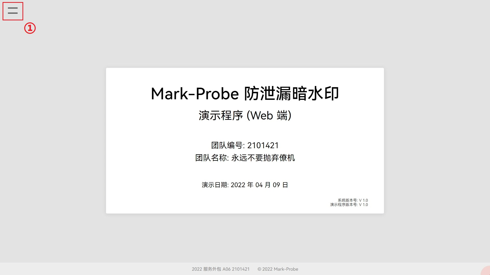
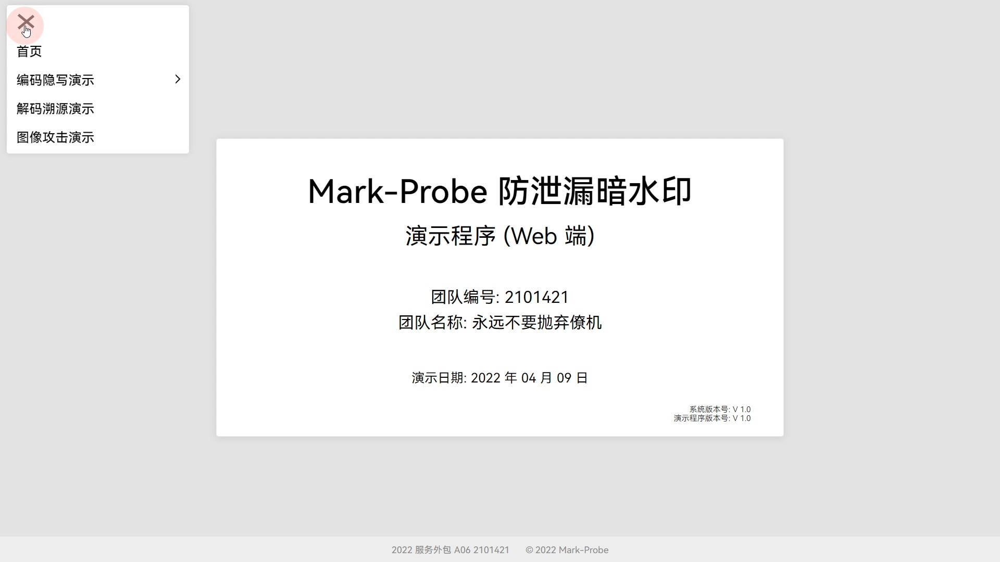
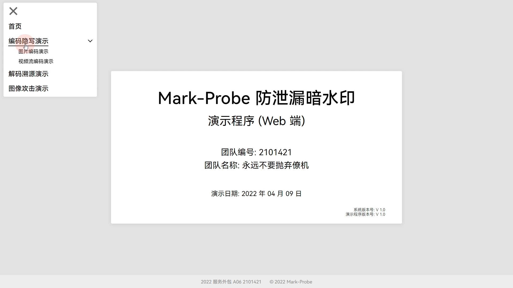
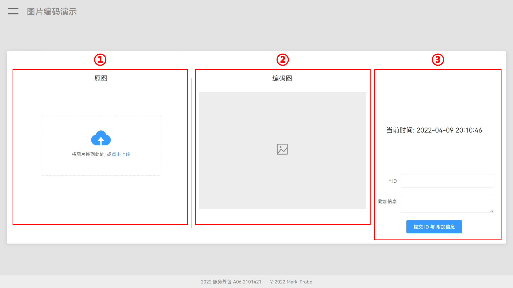
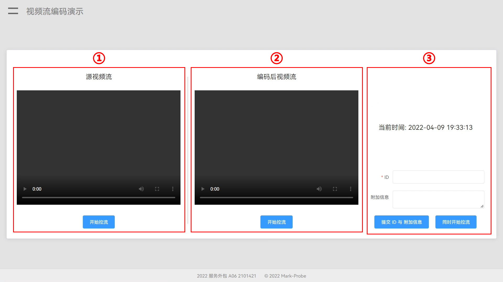
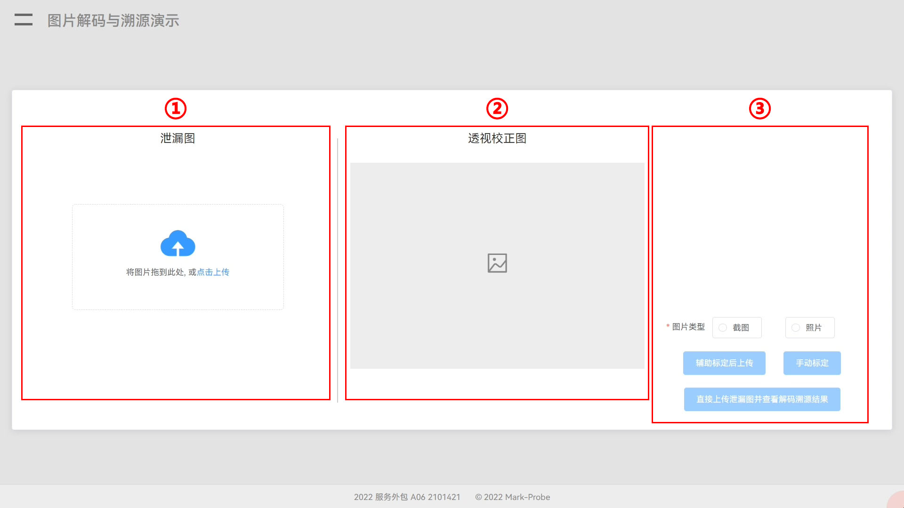
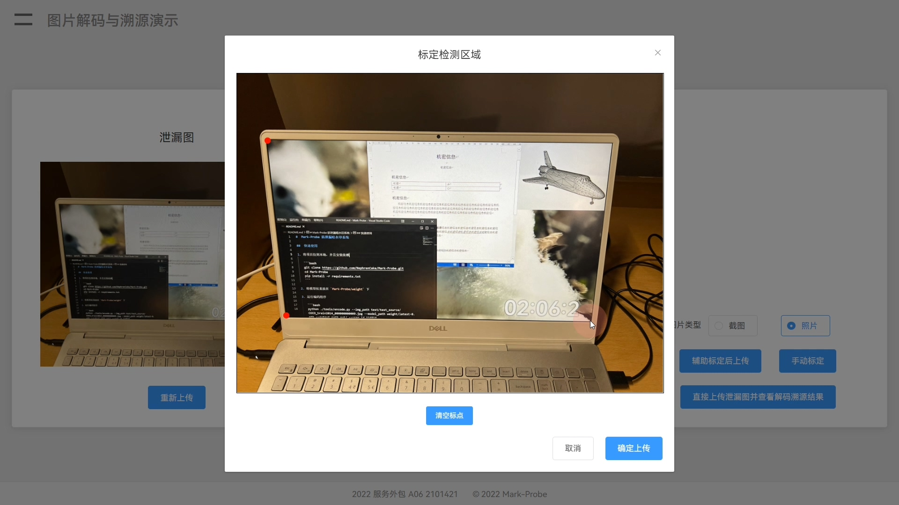
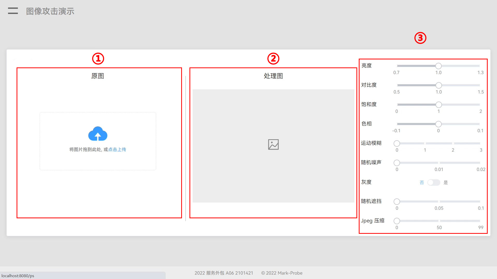

# 说明书

2022.04.10


## 部署说明（以 Windows 10 为例）

1. FFmpeg

   - 在 www.ffmpeg.org 下载编译完成的 Windows 版本的即可。
   - 配置环境变量。

2. Nginx

   Nginx 在本机上运行为两个实例，一个用来做 OBS 的推流服务，另一个用来做 服务端 的推流服务。

   这里提供一个编译完成的带有 flv 模块的版本，需要修改的就是 `Nginx` 根目录下 `conf` 文件夹下的 `nginx.conf` 中：

   ```bash
       server {
           listen 1935; # 运行端口，本服务推流端是 1935，OBS 推流端是 2935
   
           chunk_size 4000;
           application live {
               live on;
   			gop_cache on;
   			hls on;
               hls_path D:/nginx-rtmp/html/hls; # 这里改为 Nginx 对应 绝对路径 下的 html/hls，两个 Nginx 都要改
   ```

   - 双击运行 `nginx.exe` 即可作为后台服务启动。

3. Python 环境

   ```bash
   # 从 Mark-Probe 的库要求
   ```

4. 前端环境

   - 安装 Node.js （选上添加到环境变量）。

   - 在根目录下运行：

     ```bash
     cd service/frontend
     npm install
     ```

5. 运行步骤：

   - 启动两个 Nginx；（建议通过命令行启动，可以看到运行时会出的错（比如端口占用））。

   - 启动第三方推流；

     > 默认（这些可以在 `properties.py` 里面改）：
     >
     > OBS 推流到 rtmp://127.0.0.1:2953/live ，但密钥写 test
     >
     > 然后拉这个 OBS 流时，URL 为 rtmp://127.0.0.1:2953/live/test
     >
     > 
     >
     > 服务端将处理后的视频推流到 rtmp://127.0.0.1:1953/live/test

   - 保证 `db.sqlite3` 在 `service/backend/src` 下，否则需要更改 `properties.py` 中数据库的位置。

   - 在项目根目录下：

     ```bash
     # 启动后端
     python service/backend/src/main.py
     ```

     ```bash
     # 启动前端
     cd service/frontend
     npm run serve
     ```

   - 访问 http://127.0.0.1:8080 （该 URL 以前端运行后给出的 URL 为准）。


## 使用说明

#### 首页



<center>
    <div style="display: inline-block; color: #999; padding: 2px;">图 A-0</div>
</center>

**标识说明：**

①：菜单栏


**菜单栏（①）**：单击 `=` 字样可展开，展开后如下图（图 A-1）所示：



<center>
    <div style="display: inline-block; color: #999; padding: 2px;">图 A-1</div>
</center>

1. `=` 字样会变成 `×` 字样，单击 `×` 字样可关闭菜单。

2. 菜单选项中：
   - `首页` ：即当前页面。
   
   - `编码隐写演示` ：单击该项，会展开一个二级菜单，如下图（图 A-2）所示：
   
     
   
     <center>
         <div style="display: inline-block; color: #999; padding: 2px;">图 A-2</div>
     </center>
   
     - 二级菜单下，有 `图片编码演示` 和 `视频流编码演示` 两项，单击任一项则会跳转到对应页面。
   
   - `解码溯源演示` ：单击跳转到解码溯源页。
   
   - `图像攻击演示` ：单击跳转到图像攻击页。


#### 图片编码演示



<center>
    <div style="display: inline-block; color: #999; padding: 2px;">图 B-0</div>
</center>

**标识说明**：

①：原图

②：编码图

③：当前时间

④：控制台


**原图（①）**：要求用户上传一张需要进行隐写编码的图片；用户点击上传后，可以点击刚刚上传的图片进行预览，可以点击图片下方的 `重新上传` 按钮来重新上传图片（该按钮也会清除网页缓存的已经编码过的结果图），也可以点击 `确认上传` 按钮将图片送入 `Mark-Probe` 进行编码，编码完成后图片会回传到 `编码图` 部分显示，并且网页顶部显示 `上传成功！` 消息。

**编码图（②）**：这里显示用户最终上传后的编码结果图。用户可以点击编码结果图下方的 `下载编码图` 按钮以下载编码完成的结果图。

**当前时间（③）**：用来展示当前编码进原图的时间。

**控制台（④）**：这里有两个输入框和两个按钮。

- 输入框部分是用来填写编码进图片的自定义信息的，`ID` 为必选字段，`附加信息` 为可选字段，点击下方的 `提交 ID 与 附加信息` 按钮即可将想要编码进图片的信息提交到后端，接着页面顶端会显示后端接受到的自定义编码信息或错误提示信息。
- 而后再在 `原图` 部分点击 `确认上传` 按钮将图片进行编码，上传成功后，在 `编码图` 部分则显示编码了自定义信息的编码结果图。

> 其他说明：
>
> 这里推荐先在 `控制台` 部分提交自定义编码信息，然后再在 `原图` 部分上传图片，再编码图片。如果启动本演示程序后从未提交过自定义信息，并且已经进行了图片编码，则编码结果图所含信息为后端算法的预置信息；此时若要自定义编码信息，只需在 `控制台` 部分提交自定义编码信息，再进行图像编码即可。


#### 视频流编码演示



<center>
    <div style="display: inline-block; color: #999; padding: 2px;">图 C-0</div>
</center>

**标识说明**：

①：源视频流

②：编码视频流

③：当前时间

④：控制台


**源视频流（①）**：用来展示原始视频流画面。用户可点击下方的 `开始拉流` 按钮来使中间部分的视频框播放源视频流传输的视频，此时按钮字样会变为 `停止拉流` ，点击后视频框将停止播放视频。视频框部分允许用户进行暂停、全屏、音量调节与开启画中画。

**编码视频流（②）**：这里显示实时 编码视频流 传输的视频；功能说明同 `源视频流` 部分，唯一差异在于视频框拉流后显示的是编码视频流传输的视频。

**当前时间（③）**：用来展示当前编码进原始视频流画面的时间。

**控制台（④）**：这里有两个输入框和两个按钮。

- 输入框部分是用来填写编码进编码视频流的自定义信息的，`ID` 为必填字段，`附加信息` 为可选字段，点击下方的 `提交 ID 与 附加信息` 按钮即可将想要编码进编码视频流的信息提交到后端，接着页面顶端会显示后端接受到的自定义编码信息或错误提示信息。
- 而后再在 `编码视频流` 部分点击 `开始拉流` 按钮会获得编码了自定义信息的编码视频流（如果按钮字样为 `停止拉流` ，则需先点击该按钮，停止后端的编码进程，然后按钮字样会变成 `开始拉流` ，这样就可以正常使用了）。
- `同时开始拉流` 按钮即用来同时拉取源视频流和编码视频流，同时 `源视频流` 部分和 `编码视频流` 部分会分别显示各自的拉取到的视频流，这样能够方便用户观察比对编码前后的差异（若两视频流有一个正在拉流，则正在拉流的不受影响继续拉流，不在拉流的则会开始拉流，在对应视频框显示视频，同时下方对应的按钮字样也会变化）；此时按钮字样会变为 `同时停止拉流` ，点击该按钮后，左侧两部分视频流将停止拉取，按钮字样变回 `同时开始拉流` 。

> 其他说明：
>
> 这里推荐先在 `控制台` 部分提交自定义编码信息，然后再拉取编码视频流。如果启动本演示程序后从未提交过自定义信息，并且已经拉取了编码视频流，则编码视频流所含信息为后端编码算法的预置信息；此时若要自定义编码信息，只需在 `控制台` 部分提交自定义编码信息，再停止正在拉取的编码视频流，然后再拉取这个流即可。


#### 解码溯源演示



<center>
    <div style="display: inline-block; color: #999; padding: 2px;">图 D-0</div>
</center>

**标识说明**：

①：泄漏图

②：透视校正图

③：控制台


**泄漏图（①）**：要求用户上传一张需要进行解码溯源的图片；用户点击上传后，可以点击刚刚上传的图片进行预览，可以点击图片下方的 `重新上传` 按钮来重新上传图片（该按钮也会清除网页缓存的所有解码溯源结果与处理后的泄漏图）。

**透视校正图（②）**：将泄漏图进行解码溯源后返回的处理过的泄漏图。透视校正图正确显示后，下方会出现两个按钮：`下载透视校正图` 按钮允许用户保存经过透视校正的泄漏图，`查看溯源结果` 按钮则允许用户查看根据当前泄漏图进行溯源后所得的结果。

**控制台（③）**：该部分有一个单选框和三个按钮。

- `图片类型` 单选框部分：必选项，要求用户自定判断泄漏图是一张计算机系统截图还是一张拍摄所得图片，不同的选择意味着在后端对泄漏图有不同的解码方法。只有选择并上传了泄漏图后，下方的三个按钮才会允许用户点击。

- `辅助标定后上传` 按钮：将泄漏图直接上传到后端指定接口，后端使用检测算法检测出识别不分并进行透视变换，而后送入解码器进行解码、溯源。最后返回处理后泄漏图与溯源结果，并允许用户查看处理图与结果。

- `手动标定` 按钮：点击后将弹出对话框（如图 D-1 所示），要求用户在图片上进行标点，所标点即为泄漏内容的**四角**（四边形的四角），**且必须将左上角作为第一个点，接着按逆时针顺序分别标出左下角、右下角、右上角的点**。只允许用户标出四点或不标点，否则会弹出提示信息。用户可以**右键**标出的点来删除该点。对话框泄漏图下方有按钮 `清空标点` ，该点允许用户清除所有已标点。对话框右下角有 `确定上传` 按钮，允许用户在满足标定要求的情况下上传标定点数据与泄漏图到后端，进行透视变换与解码溯源，并返回结果到对话框之前的页面，而后自动关闭该对话框（用户也可不标点直接上传，返回的即为未进行过透视变换的泄漏图与解码溯源结果）。

  

  <center>
      <div style="display: inline-block; color: #999; padding: 2px;">图 D-1</div>
  </center>

- `直接上传泄漏图片并查看解码溯源结果` 按钮：顾名思义，该按钮允许用户直接上传泄漏图到后端，后端返回未处理过的泄漏图与解码溯源结果。


#### 图像攻击演示



<center>
    <div style="display: inline-block; color: #999; padding: 2px;">图 E-0</div>
</center>

**标识说明**：

①：原图

②：处理图

③：控制台


**原图（①）**：要求用户上传一张需要进行图像攻击的图片（推荐上传经过本演示程序编码过的编码图）；用户点击上传后，可以点击刚刚上传的图片进行预览，可以点击图片下方的 `重新上传` 按钮来重新上传图片（该按钮也会清除网页缓存的处理图），也可点击 `确定上传` 按钮上传该图，处理该图。

**处理图（②）**：将原图进行图像攻击后返回的处理图。处理图正确显示后，下方会出现三个按钮：`重置参数` 按钮允许用户重置参数，`下载处理图` 按钮允许用户保存处理图，`解码并溯源处理图` 按钮则允许用户将处理图送 `解码溯源演示` 页进行解码溯源。

**控制台（③）**：这里有多个滑块和开关。每个滑块和开关左侧有对该滑块或开关调整的数值或状态的说明。这里调整的数值或状态是对于原图而言的，是用来表现图像攻击的。每次数值或状态的调整都会及时地反映在 `处理图` 部分。该部分只有在 `原图` 部分已经选取了上传图片的情况下才会允许用户调整。

> 其他说明：
>
> 建议先上传原图，而后直接上传，默认会将亮度、对比度、饱和度、色相设为 1，此时返回的处理图即为原图。之后再调整数值或状态来模拟图像攻击，并将处理图送 `解码溯源演示` 页进行解码溯源。