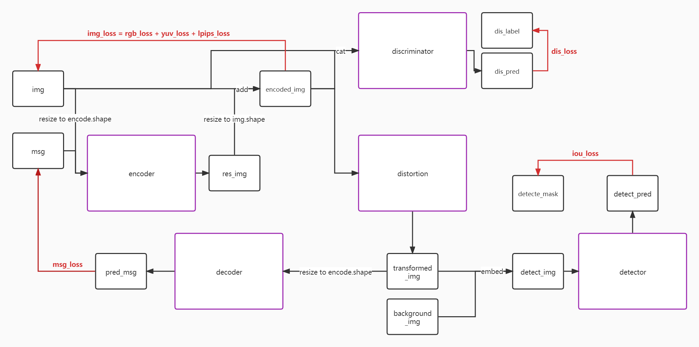
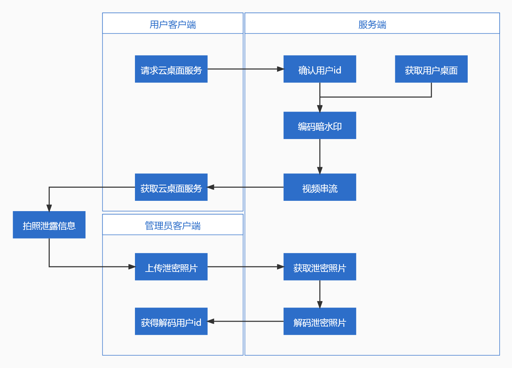

# 服创组会12.13

> - [第十三届中国大学生服务外包创新创业大赛](http://www.fwwb.org.cn/)
> - [【A06】云桌面的暗水印方案](http://www.fwwb.org.cn/topic/show/199c8731-ece6-45df-bfb0-8595ddd2980c)
> - 我们的目标是**保国二、冲国一**。

[TOC]

## 时间地点

12.13 周一下午 13:30 西苑食堂

## 主要目标

主要是让大家来提出自己对该项目的理解和想法，如何冲击国一。

- 如何完成题目要求（整理对齐算法实现、应用流程）
- 如何增加附加内容（什么是题目中不涉及，但有利于出题方思路的）
- 如何体现项目优势（如何说别人坏话）
- 需要实现的具体数据指标（如何用数据证明我们的工作）
- 后续的任务分工、时间安排（合理分配时间，尽力而为）

## 参加这次组会之前，你需要做什么

- 携带报名所需资料
- 自己搜索资料、理清自己负责部分的实现流程，并**记录**下来交流讨论最佳方案（注意，请先尽可能思考你们自己的 idea）
- 对下文提出的条目有一个自己的想法

## 组会讨论的问题细节

### 题目的基本要求

- [ ] 桌面云的办公桌面叠加暗水印后，不能影响人眼的视觉体验。
  - 多少算为“不影响人眼的视觉体验”？
    - 用其他模型生成的图来对比，我们这个深度学习的模型生成的图片感知差异性更小
    - lpips_loss 更小
- [ ] 暗水印对拍照、截屏、录屏等常规手段下，能有效进行溯源，**期望溯源成功率达到60%，此为重点指标**。
  - 我们加入了校验码，同时在训练过程中模拟了所有可能的失真效果，所以我们如何能在预期的情况下成功率低于100%？
    - 拍同一段视频，对比加入校验码前后的识别效果
  - 加入 bit 级校验码是否也算是一种优势
    - 提一嘴
  - 如何体现我们对该指标的完成情况？
    - 视频效果、数据指标（str_acc、bit_acc）
  - ==拍照之后一定需要训练一个 detector 来检测吗？==
  - ==如果截部分、旋转屏幕该如何应对？==
    - 旋转：在打印的视频案例中体现
  - 溯源的信息需要包含什么？
    - 二进制串映射到 [用户id、时间、ip地址、可拓展信息]
- [ ] 同时能对暗水印做到防止篡改、抗攻击、抗去除，是加分项。
  - 防止篡改如何体现？
    - 由于不同的种子会构建不同的模型，所以不同的 encode-decode 之间的模式相互不同，只有同一次训练的模型可以相互配合。
    - 如果直接使用裸字符串，则更改一位bit即会造成溯源错误；但加入了 bch 校验码，使得修改成错误结果变得不可能
  - 抗去除如何体现？抗攻击如何体现？
    - 有空再研究图像攻击，暂时使用随机噪声作为图像攻击【抗攻击】。
    - 实现了各种失真变换，并进行拟合适应【抗去除】。
- [ ] 研究各种“暗水印”技术，如何应用到屏幕水印中来，可以结合云桌面技术来实现，也可以在普通Windows、Linux、MAC操作系统桌面实现。
  - 实现服务端需要做什么？看后面
- [ ] 需要评估该方案实际工程落地的可行性，以及该落地的具体方案。方案希望轻量简单，实现方案层面具有较高的软硬件兼容性。
  - 是否具备、如何验证其具备实际工程落地的可行性？
    - cpu、gpu都要测帧数（提供运行环境），能用cpu更好
    - flops、参数量指标测量
  - 如何具备实际工程落地的可行性？
    - java服务端
    - 动态帧率，不动鼠标就1秒1帧
    - 前后两张图差异不大，则直接使用上一次模型跑出来的残差图

### ==如何增加附加内容==

> 即，如何体现我们在基本要求之外的工作量？基本要求提到的是我们实现的工作，在此之外我们又做了哪些工作，就都可以放在这里。

- [ ] 实现对隐写图像的检测
- [ ] 速度优化（对于相同帧不做重复运算，减轻服务器负担）
- [ ] 

### 总结项目优势

- [ ] 方案流行程度？
  - b站没有
  - YouTube只有一个官方的
- [ ] ==相比新华三？==
  - 对于复杂图片依然有良好的编码解码效果
  - 能够在拍照中检测
- [ ] ==相比 StegaStamp？==
- [ ] ==还有其他哪些隐写方法？==

### 总结具体的数据指标

- bit_acc、str_acc、lpips_loss
- cpu、gpu 运算帧率
- ==压力测试？==
- 隐含信息长度？2^56^ 映射到 7×10^16^ 条记录，记录可拓展

## 项目的实现逻辑

### 隐写逻辑（steganography）

- 编码器网络
  - 如何修改编码网络以适应超分辨率？
    - 不要修改分辨率，只使用400左右的大小。因为不能确保相机的分辨率和压缩方法。
  - img_loss应该放在哪一步？是在resize前，还是resize后？
    - loss放在resize后面比较好。即，resize400残差图至1080 -> 加上原图1080 -> loss1080原图
  - 是否可以进一步减少网络参数/提高网络速度？
    - 后续完善的次要矛盾
- 失真扰乱
  - 使用哪些失真扰乱？
    - 闪屏（）
    - 反光（加一层图片）
    - 影子（局部变暗）
    - 色彩抖动
    - 高斯模糊，线性/方块
    - jpg压缩
    - 随机成像噪声
    - 随机遮挡（散块遮挡，实现上要修改随机遮挡的逻辑）
    - 透视变换（可能会去除一些有效信息的边缘，实现上要修改 startpoint 的取值逻辑）
  - 应该使用何种方式的随机遮挡？
    - 如上文
  - 透视变换的参数设置？在留白边缘的时候是否会出现图像捕获不全？
    - 如上文
  - ==失真扰乱的顺序？==
    - 
  - ==失真扰乱的递增策略？==
    - 
  - 随机遮挡也许可以暂且当做局部识别？
    - 一方面实现随机遮挡并当做局部识别；一方面实现真正的局部识别，但需要做一个==新的逻辑，可能的话需要和前面的逻辑进行融合==
- 解码器网络
  - 

接口规范

- 

### ==检测逻辑（detection）==

- 检测网络
  - 算法类型？分割 or 关键点？
  - 检测目标？暗水印 or 屏幕？
  - 如果是暗水印，那么上面的流程有问题吗？
  - 有必要训练 detector 吗？如果评委批评检测，该如何回答？
  - 数据集的来源？

接口规范

- 

### 服务逻辑（service）

- 编码逻辑
  - 服务端的实现
    - SDK（视频流）-> java 服务器（部分预备工作，传送需要推理的图片和编码信息） -> uwsgi 服务器（提供深度学习模型计算） -> java 服务器串流
  - 如何在编码时减少运算量？
    - 动态帧率，不动鼠标就1秒1帧
    - 前后两张图差异不大，则直接使用上一次模型跑出来的残差图
  - ==以什么标准来确定是否需要进模型？==
  - 56 位 bit（7 字符）如何关联用户 id、时间、ip？
    - 映射
- 解码逻辑
  - ==如何做到局部识别？==
  - 局部识别和整体识别是否需要分开？
    - 需要，并且==需要进一步讨论实现的逻辑（细化到代码）==
    - 旋转案例在打印中体现，通过三次旋转跑四次模型

### ==演讲逻辑（10min）==

- 
- 

### ==视频逻辑==

- 
- 

## 后续的任务安排

- 寒假
  - 尚翰林
    - 探索合适的超分辨率实现方案
    - 向上提供接口
  - 邵江辉
    - 完成对隐写图像的检测
    - 向上提供接口
  - 胡辰昊
    - 整理资料，做好文档
    - 项目大致完成之后做好视频工作
  - 邵伟
    - 服务端视频串流
  - 刘亦飞
    - PPT、演讲
    - 注：在图像隐写算法上已花费 155h（2021.9.4~2021.12.8）
  - 以**一周**为单位进行汇报：可以是群里的日常交流，或者一篇开发文档
  - 在寒假要完成基本的项目流程
- 下学期
  1. 如果没做完模块功能，继续完成
  2. 学习交流各个部分的知识点
  3. 以**两周**为单位进行汇报：该周期内要完成一次优化（代码、文档）的迭代

## 补充

12届服创获奖情况：

- a01，a02，a04，a05，a07\*2，a08，a09，a11，a12\*2，a18，a19\*2，a23
- 有赛题没有一个奖，有概率会夹杂野题
- 如何辨别野题？

## 资料

### 赛程时间

1. 报名截止：2022.2.28
2. 参赛队员调整：2022.4.6~2022.4.8
3. 初赛提交：2022.4.12~2022.4.18
4. 初赛评审：2022.4.19~2022.5.4
5. 区域赛现场决赛：2022 年 5 月中下旬
6. 全国总决赛晋级名单公布：2022 年 6 月中旬
7. 全国决赛及颁奖：2022 年 7 月下旬

### 提交材料

提交材料

1. 项目概要介绍；
2. 项目详细方案，包括技术方案思路、方案DEMO；
3. 项目演示视频；
4. 项目简介PPT；
5. 企业要求提交材料：
6. 算法思路及其效果展示；
7. 团队自愿提交的其他补充材料。

任务清单

1. 对暗水印技术有一个较为全面的分析，包括各种暗水印技术的场景适用性和优缺点，给出合理的选型依据等；
2. 云桌面暗水印技术方案的概述与简介，对技术实现有充分的认识和理解；
3. 对暗水印模块运行的性能开销进行分析和优化。

### 链接

1. 深信服aDesk桌面云 http://cqsangfor.com/adesk.html