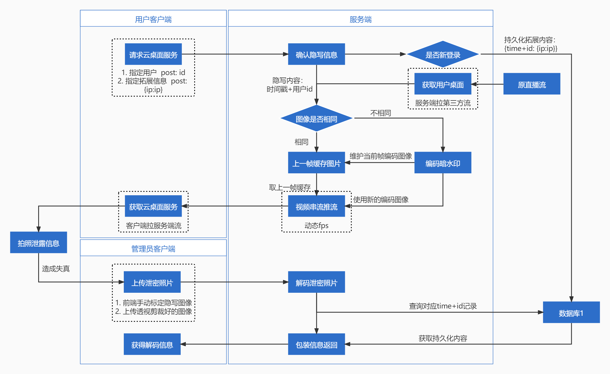
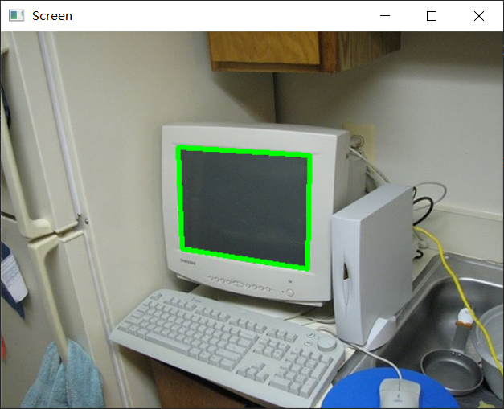
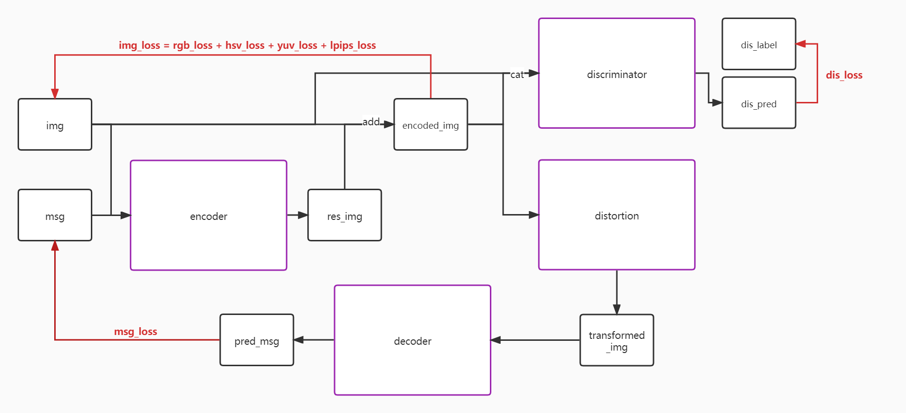
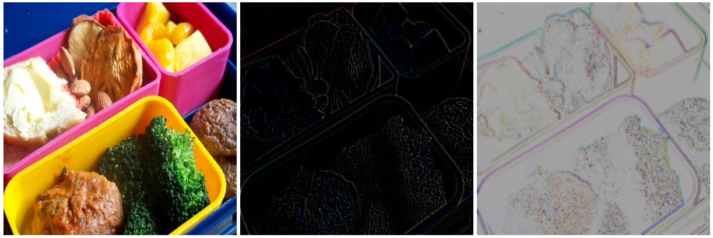
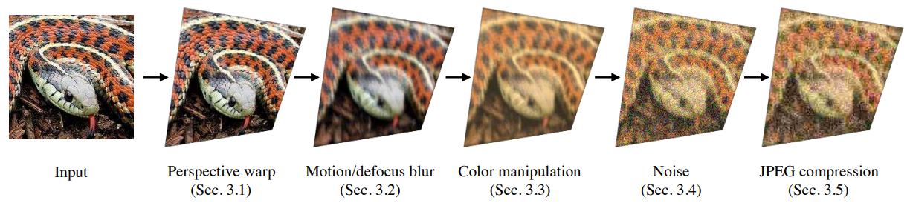

# 【A06】云桌面的暗水印方案——HiddenWatermark 项目流程总结

## 简介

- 对于一些企业或者事业单位，公司内部资料尤为重要，因此公司资料的外泄可能给公司带来巨大的损失。启用屏幕水印（明水印），可以在虚拟机上显示用户名及IP地址等信息，当用户对内网资料截屏、拍照时，就会附带水印，以此降低数据泄密风险、保证数据安全性。
- 不过明水印对于用户使用体验会造成一定影响，因此期望为客户提供“暗水印”的安全特性，即**在尽可能不影响用户体验的情况下，同样可以起到水印包含效果，对使用拍照方式的数据泄密起到威慑和追溯的作用**。
- 本项目中的暗水印的定义、要求：在某些质粒载体信息内容（**图片**）中加上掩藏标识（**写入信息**），这类标识在人们和机器设备的感受范畴以外（**最小化感知差异性**），能够做到防止篡改、抗攻击、抗去除（**抗失真**），但通过一定的技术手段又可以提取出来（**溯源**）。
- 企业命题关键字：落地。

## 服务总流程

### 项目模块概览

项目代码存放在GitHub上，按照文件夹归类。（暂时为私有，比赛结束之后脱敏公开）

```python
HiddenWatermark
- doc                    # 整合各模块各阶段的开发文档
- detection              # 整合检测模块
- service                # 整合web服务模块
- steganography          # 整合隐写模块
- tool                   # 整合库接口及演示
```

### web接口与业务展示



> 注：上图为当前的部分计划，主要用于**业务demo、速度性能、实际落地方案**的演示。除此之外，后期需要进一步封装好库接口、web接口，提供例如单张图像及单个视频文件的暗水印编码、给定目标的辅助检测。
>

web模块的任务与实质：

1. web服务演示的要求首要是前端界面好康，其次能展现我们的功能全面完整和强大。
2. 这个demo就是反映了**该算法的实际落地方案**。

web模块的落地优化思路：

1. 对于相同图像不进两次模型（动态fps），是我们在服务端的速度优化，可以有效减轻服务器的运算压力。
2. 由于模型计算量与存储开销的要求，希望能够尽可能减少数据库持久化的内容，因此使用一个用户id+一次登陆时间（而不是每分钟都存一条记录）作为双主键，唯一确定（例如ip地址等）拓展数据。
3. 泄密图片在实际应用场景中应当是比较少的数量，因此为了追求更高的解码成功率，我们提供手动标注隐写图像的功能，并以给定目标检测模型以辅助，不采用全自动检测的方案。

### 检测模块与视频展示



> 注：此部分主要用于视频demo展示，表现算法的**抗失真**的强大power。检测模块是表现隐写算法能力的重要基础，使我们锦上添花的部分。
>

检测模块的任务与实质：

- 检测模块并不是企业方要求的内容，但是有一个好的检测可以帮助我们在**视频表现力**上获得成功。
- 检测模块主要是在视频中表现**不同的失真变换**下的解码情况，展现算法的**抗失真能力**。
- 检测的目的就是找出隐写图像的四个点，这与手动标定四个角点是同级的、并列的。
- 检测在web接口服务上可以提供辅助，但最终精确的关键点标定由人工手动完成最佳。

检测模块的流程：

1. 检测目标的选择：**屏幕、白纸上的隐写图像**。
2. 检测算法的选择：
   - 首先进行语义分割，得到对象的掩码
   - 其次用传统cv检测角点
3. 通过四个关键点将预测区域透视变换成400*400的输入（decoder）的图片进行解码
4. 对于任意角度旋转的图像，需要进行4次模型推理。

### 隐写算法模块



> 注：这里展示的是本算法的训练计算图，在实际应用中只会使用到两个网络，即编码器encoder、解码器decoder。

Encoder：

- 原图 + 信息 -> 残差图
- 主体是一个 U-Net like 网络。
- 主要任务：输入一张（400×400）img 原图和一串 （96）msg 二进制数组；输出（400×400）残差图。

Decoder：

- 失真编码图 -> 预测信息
- 主体是 STN（Spatial Transformer Networks） + 普通卷积网络。
- 主要任务：输入一张（400×400）失真后的编码图，先经过 STN 计算仿射变换参数修正图像位置，再进入卷积网络做 96 个二分类；输出一串（96）二进制数组（能够表示 2^96^ 个实例分类）。

Discriminator：（实际不起主要作用，可以考虑删去）

- 编码图 -> 是否编码进信息
- 主体是一个卷积网络。
- 主要任务：输入一张（400×400）编码图；输出（25×25）热力图以及其均值。

Distortion：

- 编码图 -> 失真扰乱后的编码图
- 主体是一系列图像处理函数。
- 主要任务：模拟现实生活中可能遇到的各种失真现象。

### 库封装接口

> 注：以上讲述的隐写算法模块是纯算法部分，除此之外还需要有其他的方法来封装成可用接口来调用，包括需要用到的诸如 BCHLib 等。

1. 当前包含 bch 校验码的外部封装流程（编码接口，提供字符串信息与原图像）：
   - 给出 0~7 个任意char字符（在我们的应用场景中，应当直接提供 56 位二进制数组）
   - 对字符串进行空格填充成 len=7
   - 对上述字符串生成 len=5 的 bch 校验码（当前使用的 bch 对象设定为 5 位纠错，即 95% 的比特级解码率能提升至 100% 解码成功率）
   - 源字符串与校验码拼接成 len=12 的字符串
   - 字符串转二进制 len=96 ，转 list
   - 作为输入网络的参数，先单独进行全连接 [96] -> [7500]。（这里开始进入 encoder 网络）
   - reshape 成 [50\*50\*3]
   - 8\*8 upsample 成 [400\*400\*3]
   - 与原图 concat 成 [400\*400\*6]
   - 进入 U-Net like 网络层，输出 [400\*400\*3] 编码图
2. 对于 56 位隐写数据量的可行性计算：
   - 目前通过“时间戳+用户id”的形式对图像进行编码，唯一确定一条用户的操作记录及扩展信息。
   - 如果设计 30bit 来代表秒级时间戳，即 2^30^÷60÷60÷24÷365≈34 年，同时还剩余 26bit 来代表用户id，即 67,108,864 六千万级注册用户数；
   - 如果设计 26bit 来代表分钟级时间戳，即 2^26^÷60÷24÷365≈127.68 年，同时还剩余 30bit 来代表用户id，即 1,073,741,824 十亿级注册用户数。

## 隐写核心算法

> 懒人总结：
>
> 1. 抗失真能力强，现实情景下大多能顺利解码；
> 2. 对于不同尺度的局部图像无能为力，必须保持图像尺度不变。

### Dataset

在该项目中，并没有一个明确的“img0-label”（原图像与具体标签）的 pair，而是需要自己去构造“encoded_img-label”（编码图像与具体标签）的一个数据集。同时这个具体的标签又是我们自己写入在图像中的信息，所以就很明确了——**训练整个模型流程的数据集，其实是在运行时产生的**。

- 在图像方面，使用 coco2014 数据集。仅使用其图像，不使用任何标注。其中，0.05 用于测试、0.95 用于训练。
- 在标签方面，使用随机生成的字符串作为编码器写入的信息，同时作为解码器预测的标签。
- 预设为总体 10 epoch，每个 epoch 有 14640 iter。（以下的递增参数都将细化到 iter 级）

### Metric

损失函数的权重值是需要缓慢增加的，例如 lpips_loss。若损失的权重增长较快，则会抑制编码器、解码器两个网络之间的协调，难以找到合适的编码解码策略。
$$
Loss = α×imgLoss + β×lpipsLoss + γ×msgLoss + δ×disLoss
$$

- α、β、γ、δ 分别表示其损失的权重。该值随时间推移，递增至一定水平后固定。
- img_loss：能够与进行 weight_mask 加权的图像损失之和。
  - rgb_loss：rgb 通道上的 mse_loss
  - hsv_loss：rgb 转 hsv 之后的 mse_loss（原论文没有）
  - yuv_loss：rgb 转 yuv 之后的 mse_loss
- lpips_loss：一个基于深度学习的感知差异性损失（指导效果很强）
- msg_loss：解码器中二进制位解码结果与标签值的 binary_cross_entropy
- dis_loss：鉴别器中原图为 0 编码图为 1 的 binary_cross_entropy
- bit_acc：（不参与损失，仅计算准确率）二进制位级的准确率
- str_acc：（不参与损失，仅计算准确率）只有当整条字符串二进制位完全正确时，才会被认为是正确的（所以低一些没有太大问题）
- strength_acc：（不参与损失，仅计算准确率）当整条字符串二进制位正确率在95%\~100%时，都认为是正确的（用数据证明校验码的有效性）

为了降低模型生成的编码图像的感知差异性，根据人眼对于高频信息不敏感，我们实现了与原论文不同的损失计算方式，引入了权重掩码。

- 仅通过原图来确定其本身的高低频区域，自适应地对不同的区域施加不同程度的 loss 权重

  - 我们希望模型在高频部分编码，其实就是等价于**高频部分的编码图和原图的差异是可以容忍的**；
  - 我们不希望模型在低频部分编码，其实就是等价于**低频部分的编码图和原图的差异要最小化**。

- 例如：

  - ```python
    def mse_loss(pre, tar, mask):
        return torch.mean((pre - tar) ** 2 * mask)
    
    blur_loss_trans = transforms.GaussianBlur((7, 7), sigma=10)
    mask = torch.abs(img0 - blur_loss_trans(img))
    mask = torch.max(mask) - mask  # 在范围内翻转高低频区域的数值，作为最终的损失权重
    print(torch.max(mask))  # 0.6370
    print(torch.min(mask))  # 0
    yuv_loss = mse_loss(rgb_to_yuv(encoded_img), rgb_to_yuv(img), mask=weight_mask)  # 使用位置损失权重进行优化
    ```


下面分别是：原图、原图与原图高斯模糊后的残差图（越亮代表频率越高）、将残差图的高低频数值对调获得的 weight_mask（越亮越白表示施加的 loss 权重越大，越黑或者彩色表示某些通道的 loss 越低）



### Distortion

失真扰乱，是在现实中由光场、空间、设备等一系列原因使得图像在传输中发生的变化，这些变化会严重影响到解码的顺利进行。为了抵抗这些变化造成的影响，就需要在编码解码器之间加入对这些随机变化的拟合，让两个网络之间相互协调、在隐写图像失真的情况下依然能够溯源信息。

- 所有的失真变换列表：
  - 色彩抖动
  - 高斯模糊（线性/方块）
  - 随机成像噪声
  - 反光（加一层图片）
  - 影子（局部变暗）
  - 随机遮挡（散块遮挡）
  - jpeg压缩
  - 透视变换

当前已经实现的变换：

1. 第一次空间变换——**模拟相机与屏幕的视角差**
2. 亮度、对比度、饱和度、色调的抖动——**模拟不同相机的成像差异**
3. 模糊——**模拟运动模糊**
   - 需要实现随机方向的运动模糊
4. jpeg压缩——**模拟图片保存**
5. 随机噪声——**模拟成像噪声**
6. 第二次空间变换——**模拟检测器的不精确结果**
   - 需要重新修改4个点的选取方式，要实现边缘信息的意外丢失

还需要加入的变换：

1. 屏幕反光
   - 需要保证计算图流通
   - 权重大小的控制
   - 添加位置的随机参数
2. 影子（局部变暗）
3. 随机遮挡（要分成散块状的遮挡，实现上要修改随机遮挡的逻辑）




## 总结与题目要求再讨论

### 项目对题目的完成度

1. 桌面云的办公桌面叠加暗水印后，不能影响人眼的视觉体验。
   - 多少算为“不影响人眼的视觉体验”？
     - 用其他模型生成的图来对比，我们这个深度学习的模型生成的图片感知差异性更小
     - lpips_loss 值更小
2. 暗水印对拍照、截屏、录屏等常规手段下，能有效进行溯源，**期望溯源成功率达到60%，此为重点指标**。
   - 我们加入了校验码，同时在训练过程中模拟了所有可能的失真效果，所以我们如何能在预期的情况下成功率低于100%？
     - 拍同一段视频，对比加入校验码前后的识别效果
   - 加入 bit 级校验码是否也算是一种优势
     - 算，就当是我们自己想到的
   - 如何体现我们对该指标的完成情况？
     - 视频效果、训练数据指标（str_acc、bit_acc）
   - 拍照之后一定需要训练一个 detector 来检测吗？
     - 不，检测不是主要矛盾
   - 如果截部分、旋转屏幕该如何应对？
     - 旋转、局部识别：暂时先在打印的视频案例中体现
   - 溯源的信息需要包含什么？
     - 用户id+时间，映射到 ip地址等可拓展信息
3. 同时能对暗水印做到防止篡改、抗攻击、抗去除，是加分项。
   - 防止篡改如何体现？
     - 不同的随机种子应该会构建不同的模型，所以不同的 encode-decode 之间的模式相互不同，只有同一次训练的模型可以相互配合。
     - 如果直接使用裸字符串，则更改一位bit即会造成溯源错误；但加入了 bch 校验码，使得修改成错误结果变得不可能。
   - 抗去除如何体现？抗攻击如何体现？
     - 暂时使用随机噪声作为图像攻击【抗攻击】。
     - 实现了各种失真变换，并进行拟合适应【抗去除】。
4. 研究各种“暗水印”技术，如何应用到屏幕水印中来，可以结合云桌面技术来实现，也可以在普通Windows、Linux、MAC操作系统桌面实现。
   - 实现服务端需要做什么？
     - 服务端实现作为我们的具体落地方案。
5. 需要评估该方案实际工程落地的可行性，以及该落地的具体方案。方案希望轻量简单，实现方案层面具有较高的软硬件兼容性。
   - 是否具备、如何验证其具备实际工程落地的可行性？
     - cpu、gpu都要测帧数，能用cpu更好
   - 如何具备实际工程落地的可行性？
     - 动态帧率，相同图像不进两次模型

### 项目优势

- 方案流行程度
  - 方案流行程度较低，在b站没有相关信息，在YouTube只有一个官方的
- 相比新华三
  - 对于复杂图片依然有良好的编码解码效果，并且高频区域感知差异性更低。
  - 能够在拍照中检测
- 相比 StegaStamp
  - 对损失函数进行了优化，对于高低频区域加入不同的损失权重，以此获得了感知差异性更低的编码图像
  - 对失真变换的顺序进行了研究，更加符合真实场景的因素干扰
  - 解决了论文模型无法自适应大小的问题（实际上还需要进一步研究，残差图的随机放大是否可行
  - 简化了训练过程，摒弃了冗余的鉴别器（真的可以删掉（删之前push一下代码
  - 显式地在训练过程中加入遮挡，更能够帮助训练解码局部图像
  - 减少了参数量，使之更易于部署实际服务
    - 实际上原论文已经很少了（1739999），但是应该可以把最下面一层网络删掉，继续减少参数试试
      - 卷积决定运算速度，全连接决定参数量
    - 可以把 100 位长 bit 直接砍成 96bit，少 4 位也是少
    - 网络剪枝（又是一个深坑

### 项目暂不完备之处

1. 对于局部检测
   - 一方面实现随机遮挡并当做局部识别；一方面实现真正的局部识别。
2. 对于推理速度（如何落地）
   - 进一步提高模型的运算速度。

## 任务安排

寒假
- 尚翰林
  - 探索合适的超分辨率实现方案
  - 优化失真变换等一系列训练过程
  - 封装库接口
  - 优化网络模型
- 邵江辉
  - 完成对隐写图像的检测
- 胡辰昊
  - 整理所有资料，做好文档
  - 项目大致完成之后做好视频工作（两个视频，一个作为提交的基本材料，一个作为答辩辅助材料，后者为前者的缩水版）
- 邵伟
  - 前后端业务的实现
- 刘亦飞
  - 协助以上工作
  - PPT、演讲
- 以**一周**为单位进行汇报：记录想法、实现的内容，提供简单的开发文档
- 在寒假要完成基本的项目流程

大三下
- 如果没做完模块功能，继续完成
- 学习交流各个部分的知识点
- 以**两周**为单位进行汇报：该周期内要完成一次优化（代码、文档）的迭代

## 快速访问

### 赛程时间

1. 报名截止：2022.2.28
2. 参赛队员调整：2022.4.6~2022.4.8
3. 初赛提交：2022.4.12~2022.4.18
4. 初赛评审：2022.4.19~2022.5.4
5. 区域赛现场决赛：2022 年 5 月中下旬
6. 全国总决赛晋级名单公布：2022 年 6 月中旬
7. 全国决赛及颁奖：2022 年 7 月下旬

### 提交材料

提交材料

1. 项目概要介绍；
2. 项目详细方案，包括技术方案思路、方案DEMO；
3. 项目演示视频；
4. 项目简介PPT；
5. 企业要求提交材料：
6. 算法思路及其效果展示；
7. 团队自愿提交的其他补充材料。

任务清单

1. 对暗水印技术有一个较为全面的分析，包括各种暗水印技术的场景适用性和优缺点，给出合理的选型依据等；
2. 云桌面暗水印技术方案的概述与简介，对技术实现有充分的认识和理解；
3. 对暗水印模块运行的性能开销进行分析和优化。

### 引用链接

1. 第十三届中国大学生服务外包创新创业大赛  http://www.fwwb.org.cn/
2. 【A06】云桌面的暗水印方案  http://www.fwwb.org.cn/topic/show/199c8731-ece6-45df-bfb0-8595ddd2980c
3. 深信服aDesk桌面云  http://cqsangfor.com/adesk.html
4. 本项目GitHub仓库  https://github.com/NephrenCake/HiddenWatermark
5. StegaStamp视频演示  https://www.matthewtancik.com/stegastamp
6. StegaStamp仓库地址  https://github.com/tancik/StegaStamp
7. StegaStamp论文  https://paperswithcode.com/paper/stegastamp-invisible-hyperlinks-in-physical
8. coco2014数据集下载  https://blog.csdn.net/u013249853/article/details/84924808

